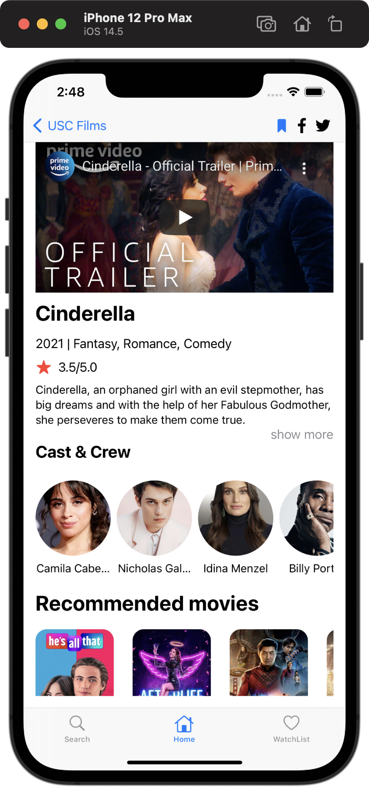
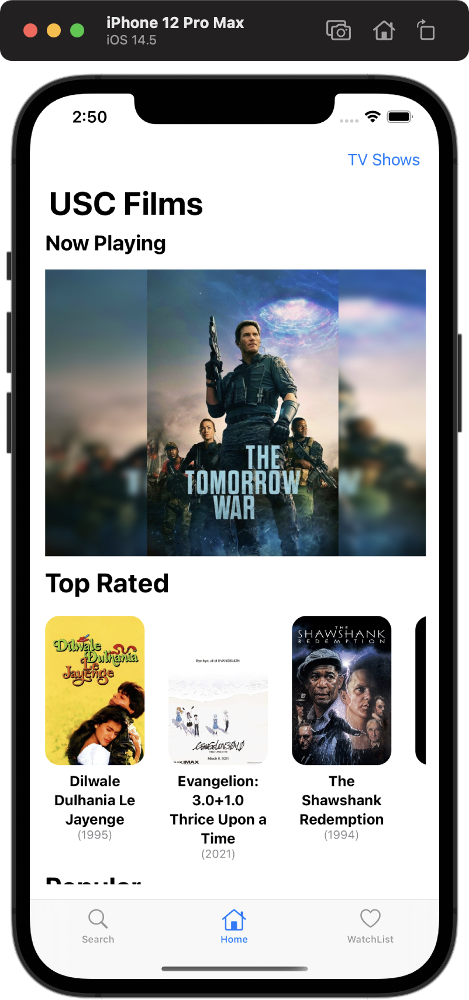
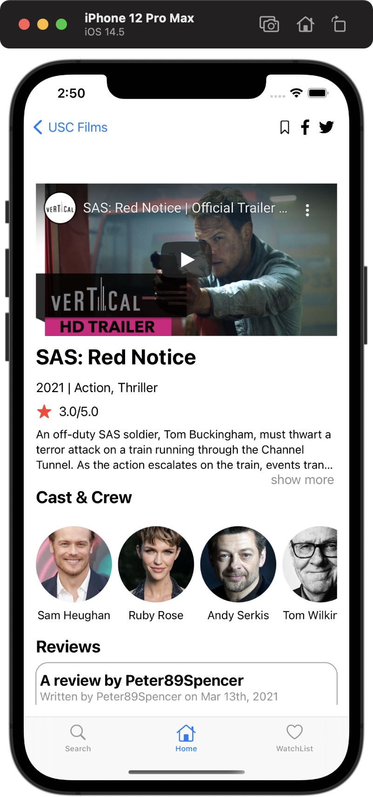
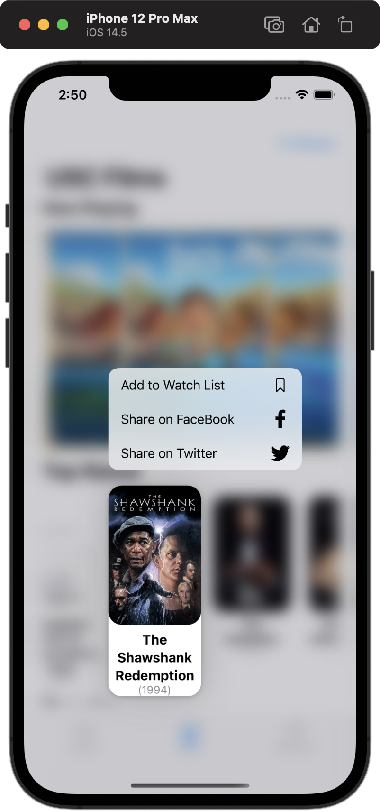
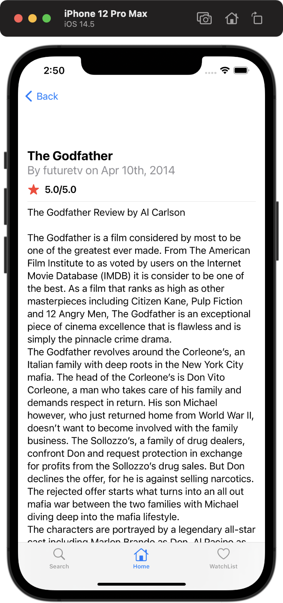
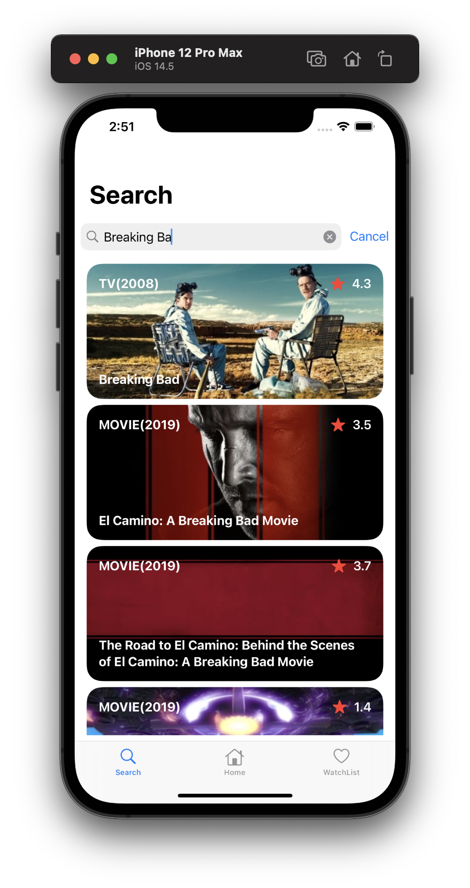
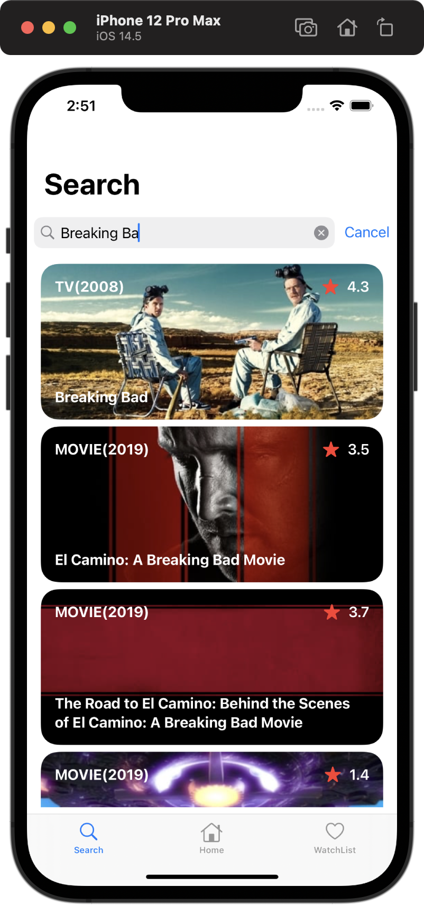
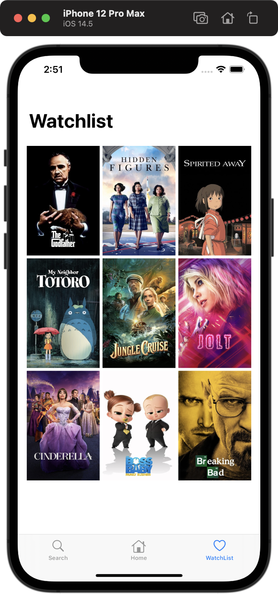

# Mobile-Films

A iOS film App

## Table of contents

- [General info](#general-info)
- [Technologies](#technologies)
- [Screen Shots](#screenshots)
- [Setup](#setup)

## General info

An iOS app created by Swift UI using Xcode that shows the popular / top-rated movies / tv shows and alow user to search and view the trailer / reviews / casts / related movies. User can also add their favorite movies to a persistant watch list and share to twitter or facebook. Powered by tmdb

## Technologies

Project is created with:

- SwfitUI/Xcode
- AWS

## Screen Shots










## Setup

To run this project, install it locally using node:

```
$ pod install
```
